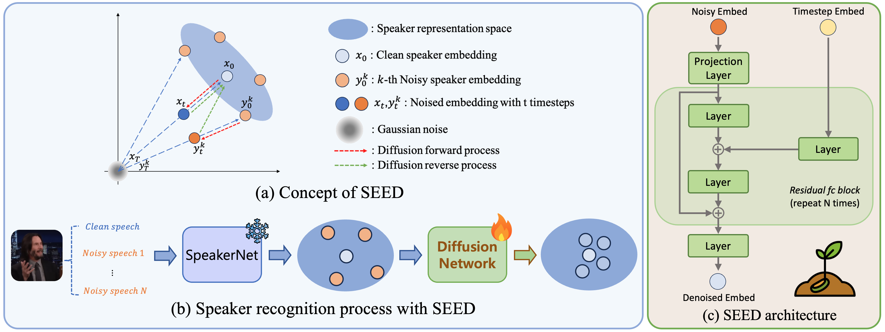

# **SEED: Speaker Embedding Enhancement Diffusion**
## Accepted at Interspeech 2025 | Pytorch Implementation

[](#license) [](#requirements) [](#)

---

## 🚀 Overview

**SEED** is a first diffusion-based embedding enhancement framework designed to improve speaker representation robustness under adverse acoustic conditions. It leverages a powerful diffusion network paired with state-of-the-art speaker representation models (ResNetSE34V2, ECAPA-TDNN) to refine original speaker embeddings into more noise-robust speaker representations.

We believe that the SEED framework can be applied to various representation models (e.g., for Speech Recognition, Speech Emotion Recognition, Face Recognition, etc.), not just for speaker recognition tasks.

<p align="center">
  
</p>

### ✨ Key Features

* **Lightweight and Simple**: Easily applied to all speaker representation models, including ResNetSE34V2, ECAPA-TDNN, and WavLM-ECAPA, etc.
* **No Speaker Labels Required**: Can be trained on any clean speech data without explicit labels.

---

## 📦 Contents

1. [Requirements](#requirements)
2. [Datasets](#datasets)
3. [Training](#training)
4. [Evaluation](#evaluation)
5. [Pretrained Models](#pretrained-models)
6. [Configuration Reference](#configuration-reference)
7. [Extending SEED](#extending-seed)
8. [License & Citation](#license--citation)

---

## Requirements

* **OS**: Linux
* **Python**: 3.8+
* **System Tools**: `wget`, `ffmpeg`
* **CUDA Toolkits**: 12.5.0 
* **Pytorch**: 2.1.2
> **Note**: In author's environment, we use `conda install nvidia/label/cuda-12.5.0::cuda-toolkit` (https://anaconda.org/nvidia/cuda-toolkit)

Install Python dependencies:

```bash
pip install -r requirements.txt
sudo apt-get install wget ffmpeg
```

---

## Datasets

### Prepare SEED Training and Evaluation Datasets

First, please read [datasets/README.md](datasets/README.md) for more details.
You can make all datasets by following the instruction in [datasets/README.md](datasets/README.md).

### Training Dataset Summary

SEED is trained on the following clean speech datasets and audio-augmentation datasets:

* **LibriTTS-R**  (`train-clean-100` + `train-clean-360`, \~460h)
* **Libri-Light** (`small`, \~577h)
> **Note**: SEED does *not* require speaker labels. Provide a manifest file listing `<dummy_speaker_id> <file_path>` per line.

* **MUSAN** (Music, Speech, and Noise)
* **RIRs**  (Room Impulse Responses)
> **Note**: SEED use these datasets for audio-augmentation (simulating noisy speech data from clean speech data).

```text
# Example: For libritts + librilight (1,000h), we make a manifest file like this:
train_libritts+librilight_1000h.txt
/path/to/libritts-R_16k/1241/103_1241_000071_000000.wav
/path/to/libritts-R_16k/1241/1040_133433_000157_000000.wav
```

### Evaluation Dataset Summary

* **VoxCeleb1 (For validation of training results)**
* *VC-Mix* & *VoxSRC23* for environmental robustness benchmarks 


Manifests are located under `datasets/manifests/`:
```bash
datasets/
├── manifests/
│   ├── train_libritts+light_1000h.txt
│   ├── vox1-O.txt
│   ├── vcmix_test.txt
```

---


## 🏋️ Training

### ResNetSE34V2 + SEED

```bash
python main.py \
  --config configs/ResNetSE34V2_SEED_rdmmlp3.yaml \
  --save_path exps/resnetse34v2_SEED_rdmmlp3
```

* **Backbone**: `ResNetSE34V2`
* **Diffusion**: `rdm_mlp`, layers=3
* **Timesteps**: Train=1000, Sample=50
* **Loss**: L1
* **Self-Conditioning**: Enabled

### ECAPA-TDNN + SEED

```bash
python main.py \
  --config configs/ECAPA_TDNN_SEED.yaml \
  --save_path exps/ecapa_tdnn_SEED
```

#### Tips

* `--mixedprec` for mixed-precision for fp16 training (To fast training).
* `--distributed` for DDP (set like `CUDA_VISIBLE_DEVICES=0,1,2,3`). 
> **Note**: In this paper, we didn't use `--mixedprec` and `--distributed` options.

---

## 🧪 Evaluation

### Diffusion & Backbone Combined

```bash
# ResNetSE34V2
python main.py \
  --eval \
  --config configs/ResNetSE34V2_SEED_rdmmlp3.yaml \
  --pretrained_backbone_model pretrained/official_resnetse34V2.model \
  --pretrained_diffusion_model pretrained/resnet34V2_SEED_evalseed_2690.model \
  --seed 2690
  --train_diffusion True
```

```bash
# ECAPA-TDNN
python main.py \
  --eval \
  --config configs/ECAPA_SEED_rdmmlp3.yaml \
  --pretrained_backbone_model pretrained/official_ecapatdnn.model \
  --pretrained_diffusion_model pretrained/ecapa_SEED_evalseed_898.model \
  --seed 898
  --train_diffusion True
```

### Backbone Only (Baseline)

```bash
python main.py \
  --eval \
  --config configs/ResNetSE34V2_baseline.yaml \
  --pretrained_backbone_model pretrained/official_resnetse34V2.model \
  --test_path datasets/voxceleb1 \
  --test_list datasets/manifests/vox1-O.txt \
  --train_diffusion False
```

---

## 📝 Configuration Reference

```yaml
# Speaker Backbone
model: ResNetSE34V2
batch_size: 300
nOut: 512
pretrained_speaker_model: ./pretrained/official_resnetse34V2.model

# Diffusion
train_diffusion: True
diffusion_network: rdm_mlp
diffusion_num_layers: 3
train_timesteps: 1000
sample_timesteps: 50
self_cond: True

# Optimizer
lr: 5e-4
optimizer: adamW
```

---

## 🛠️ Extending SEED to your own representation model

1. **Add new backbones** in `models/yourtask/your_backbone.py`.
2. Customizing `DatasetLoader.py` for your own dataset.
3. Prepare your own training datasets (with augmentation strategies) and evaluation datasets.
4. Follow existing modules as templates.
5. Run main.py!

---

## 📂 Pretrained Models

> Official checkpoints can be downloaded under `pretrained/`.

For SEED, we provide the following pretrained models:
* **ResNetSE34V2** (backbone): `official_resnetse34V2.model`
* **-->**          (SEED-Diffusion): `resnet34V2_SEED_evalseed_2690.model`
* **ECAPA-TDNN**   (backbone): `official_ecapa_tdnn.model`
* **-->**          (SEED-Diffusion): `ecapa_SEED_evalseed_898.model`

---

## 📜 License & Citation

<!-- This project is licensed under the [MIT License](LICENSE).

If you use SEED in your research, please cite:

```bibtex
@inproceedings{lee2025seed,
  title={Speaker Embedding Enhancement Diffusion},
  author={Lee, First and Colleague, Second and ...},
  booktitle={Interspeech},
  year={2025}
}
``` -->

---
